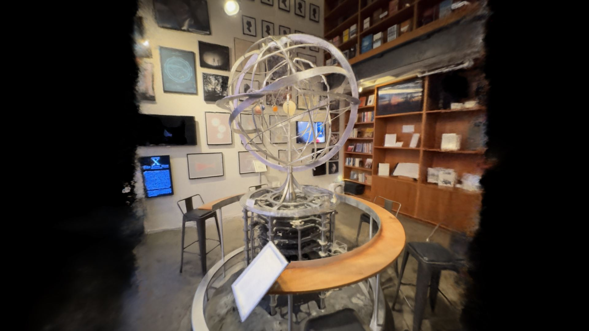

# A-Frame LifeCast Volumetric Player Component

<p align="center">
  
</p>


This is A-Frame component for LifeCast's volumetric video and photo player. The repository also contains simplified Three.js version of the player.

## Usage
To use the component add "lifecast-component" to an entity in A-Frame scene. See below the example:
```
<!DOCTYPE html>
<html>
<head>
<title>Lifecast LDI Player</title>
<meta name="viewport" content="width=device-width, initial-scale=1.0, user-scalable=no">
<meta name="apple-mobile-web-app-capable" content="yes">
<script src="https://aframe.io/releases/1.6.0/aframe.min.js"></script>
<script src="lifecast-videoplayer-component.js"></script>
</head>
<body>
  <a-scene >
  <a-entity lifecast-component="media_urls: facepaint_ldi3_h264_1920x1920.mp4; decode_12bit: true; enable_intro_animation: true" position="0 0 0">
  </a-entity>
</a-scene>
</body>

</html>

```
The component has the following parameters:
- <b>media_urls: { type: "array", default: ["orrery_transp_ldi3.jpg"] }</b> - URL to ldi3 video (mp4) or photo. If no url is provided, default url is used.
- <b>decode_12bit: { type: "boolean", default: true }</b> - If 12 bit decoder should be used or not. True or false. Defaults to true.
- <b>enable_intro_animation: { type: "boolean", default: true }</b> - If intro animation should be applied. True or false. Defaults to true.

## Tech Stack
The project is based on Lifecast Inc's immersive volumetric video and photo player (see: https://github.com/fbriggs/lifecast_public). It is powered by A-Frame and Three.js.

## Demo
To see demo, please visit the <a href="https://lifecast-component.glitch.me/">following page</a>

